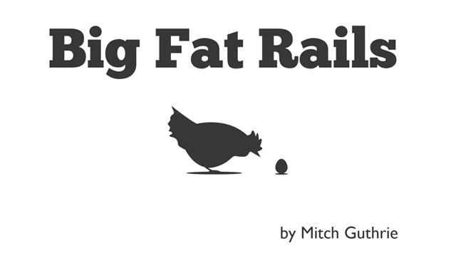

% 

# What's This Book About?

The purpose of this book is to teach someone new to Ruby on Rails how to get stuff done and start developing their own applications quickly. A focus will be on learning topics precept upon precept in small digestable steps.

As the book proceeds the reader will build upon existing knowledge to grow deeper in understanding and connect not just the "how" of the process, but the "why" as well.

Underlying ideas will be covered like MVC, REST, and how to organize code so that it makes sense to you and those who will work with you.

There are a lot of things to learn when developing an application by current standards such as TDD, BDD, proper MVC and so on. It is here that we run into a chicken and egg problem that is inherit in learning any complicated subject: the theory is often hard to understand separate from seeing it in practice, and seeing it in practice can then be difficult to understand if you don't have a full grasp of the theory. (Feel free to read that again, I had to.)

Consider a math teacher who would write an equation on the board then say something completely irksome like "and if we factor and reduce this equation we get this". This is great if you know the process of factoring and reducing but if you don't that final equation can seem almost magical.

What this means to the reader is that sometimes we may progress down a path in a fashion that seems contrary to what is considered good practice but in fact is only done so we can understand what a "good practice" is and why we should do it that way. 

Ruby on Rails does a lot of "factor and reduce" to make development easier for those who know the conventions. My goal with this book is to fill in some of the factor and reduce material so you, the reader, have a firm grasp on what's going on.

That is the last analogy I'll discuss regarding math. I promise.

## This Book Is A Work In Progress!!

This book is currently being developed. Every ebook should have a version number. Things are going to be changing a lot while this book is in development. The latest and greatest can always be found at <http://www.bigfatrails.com>.

## What Should I Already Know?

You should have experience with HTML/XHTML, CSS, Javascript, and a basic understanding of how the web works. A basic proficiency with Ruby is a must and there a plenty of tutorials to get you up to speed.

## About The Author

My name is Mitch Guthrie and I am a web developer. I'm just a guy. I don't really have any fancy pedigree, I'm not formally trained, but I've made it my goal to persue quality and depth in my day to day. I would call myself a "secondary teacher". My desire in teaching others can be summed up with the following quote ^[Mortimer Adler, How to Read a Book (New York: Simon and Schuster, 1940), p. 60.]:

>[The secondary teacher] should regard himself as learning from the masters along with his [students]. He should not act as if he were a primary teacher, using a great book as if it were just another textbook of the sort one of his colleagues might write. He should not masquerade as one who knows and can teach by virtue of his original discoveries... The primary sources of his own knowledge should be the primary sources of learning for his students, and such a teacher functions honestly only if he does not aggrandize himself by coming between the great books and their... readers. He should not “come between” as a nonconductor, but he should come between as a mediator—as one who helps the less competent make more effective contacts with the best minds. ^[I discovered this quote from watching "Why You Don't Get Mock Objects by Gregory Moeck" - <http://www.youtube.com/watch?v=R9FOchgTtLM>]

I'm not perfect. Things will change. What was once considered good programming practice is now the albatross around the neck of the programmer ^[http://en.wikipedia.org/wiki/The_Rime_of_the_Ancient_Mariner]. The idea isn't to get everything perfect from here on out. The idea is to improve consistently over time.

You can contact me at mitch@bigfatrails.com or follow me on twitter: @mentalbrew <http://twitter.com/mentalbrew>.

## Conventions

All source code will be in a mono font and indented like this:

``` {.ruby .lineNumbers}
	class Example
	  def initialize(greeting=nil)
	    @greeting = greeting
	  end
	end
```

Terminal output will look similar:

```
	total 24
	drwxr-xr-x 7 mentalbrew mentalbrew 4096 2011-08-02 12:02 build
	-rw-r--r-- 1 mentalbrew mentalbrew 4519 2011-08-02 08:52 make.bat
	-rw-r--r-- 1 mentalbrew mentalbrew 4602 2011-08-02 08:52 Makefile
	drwxr-xr-x 4 mentalbrew mentalbrew 4096 2011-08-02 08:52 source
```

**NOTE**

:	A note will be used point out something interesting or significant.

**WARNING**

:	A warning will serve to point out something you should know regarding the topic that could be a gotcha.

You can find footnotes like this ^[Related information will be available in the footnotes.] at the bottom of the page.

## License

\

This work is licensed under the Creative Commons Attribution-NonCommercial-NoDerivs 3.0 Unported License. To view a copy of this license, visit <http://creativecommons.org/licenses/by-nc-nd/3.0/> or send a letter to Creative Commons, 444 Castro Street, Suite 900, Mountain View, California, 94041, USA.

## Credits

The chicken and egg logo are from the artwork titled Paradox by Carlos Navas. Used with permission.

The music for the screencasts is Slumlord by Lo Tag Blanco and licensed under Creative Commons.

## Software Versions

This book uses Rails 3.2 and Ruby 1.9.3. I'm developing on both Mac OS X Lion and Ubuntu 11.10.

To avoid getting bogged down in potential design issues and since this book is not covering web design we will be using the Twitter Bootstrap ^[<http://twitter.github.com/bootstrap/>] framework to quickly get are app up and looking decent.

## FAQ

* Will this make me a Rails guru?
	* Yes. All you need to do is read this book as well as every other Rails book, and practice everyday for over 10,000 hours.
* Urban Dictionary says that a "fat rail" is a thick line of cocaine. Does this book have anything to do with cocaine?
	* No, this book has nothing to do with cocaine but if it perhaps garners interest in the coveted recovering addict demographic then I think they should be able to learn Rails if they want. If I were to exclude any book title that matches something in Urban Dictionary then this would simply be titled "A book".
* I don't like your writing style. Can you change it?
    * I don't like your reading style. No.

## Disclaimer

The author assumes no responsibility for errors or omissions, or for damages that may result from the use of information (including program listings) contained herein. Should this book result in mental trauma, physical damage of computer equipment, or a bill of divorcement from spouse that would be really sad but not the author's fault.

