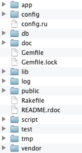
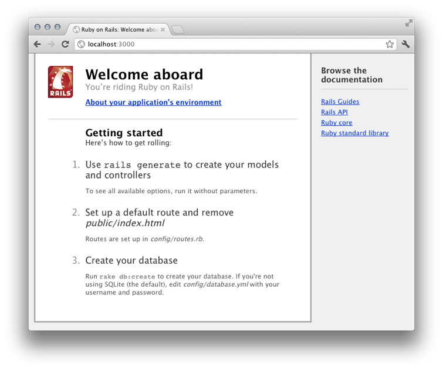

# Beginning Ruby on Rails

The first aspect of getting started with Ruby on Rails is installing it. We've built up quite the little development process here by using RVM for managing our ruby versions. Now, we are going to be using RubyGems which ships with ruby 1.9.3. 

## Installation

To install Rails using RubyGems simply type:

```
	gem install rails --no-ri --no-rdoc
```

This will then go and fetch the most recent development Rails gems and all of the other gem dependencies needed to make Rails function. This will be a long list and may take awhile depending on the speed of your computer and internet access.

The `gem` command is used to install ruby packages and their dependecies. If you know that name of the package you wish to install `gem install <packagename>` will do that for you. Here we specified rails. There are a few flags that we listed after our command which do the following:

--no-ri

:	This will tell rubygems not to install the ruby information regarding each gem. You can have this if you want but it does slow down the install process quite a bit.

--no-rdoc

:	Similar to `--no-ri` this will tell ruby not to install system documentation for each gem. Omitting this makes the installation take longer.

**NOTE**

:	If you wish to have the --no-ri and --no-rdoc options by default simply create a `.gemrc` file in the root of your home directory and add this line:

	```
		gem: --no-rdoc --no-ri
	```

The following is a brief snippet of what you should see when installing Rails for the first time:

```
	Fetching: i18n-0.6.0.gem (100%)
	Fetching: multi_json-1.0.4.gem (100%)
	... (omitted)
	Fetching: json-1.6.5.gem (100%)
	Building native extensions.  This could take a while...
	Fetching: rdoc-3.12.gem (100%)
	Fetching: railties-3.2.1.gem (100%)
	Fetching: rails-3.2.1.gem (100%)
	Successfully installed i18n-0.6.0
	... (omitted)
	Successfully installed rails-3.2.1
	30 gems installed
```

You now have the most up-to-date version of Rails installed on your system and ready to go. Now that we have Rails installed it's time to create a brand new Rails project.

## A New Rails Project

We are going to create a new project named **Bankroll**. To create this new Rails project you can type the following command:

```
	rails new bankroll --skip-bundle
```

This will create a bunch of directories and files for your new Rails project as shown below. The `--skip-bundle` flag tells Rails not to immediately install dependencies for you project.

```
	create  
	create  README.rdoc
	... (omitted)
	create  vendor/assets/stylesheets/.gitkeep
	create  vendor/plugins
	create  vendor/plugins/.gitkeep
```

Once that command is done you'll want to change into the project directory like so:

```
	cd bankroll
```

The then install all of the necessary packages to get your application up and running and specify that you want binary stubs using the `--binstubs` flag:

```
	bundle install --binstubs
```

The following is an edited version of what you should see when bundle is installing dependencies:

```
	Fetching source index for https://rubygems.org/
	Using rake (0.9.2.2) 
	... (omitted)
	Installing sass-rails (3.2.4) 
	Installing sqlite3 (1.3.5) with native extensions 
	Installing uglifier (1.2.3) 
	Your bundle is complete! Use `bundle show [gemname]` to see where a 
	bundled gem is installed.
```

So, what the heck happened? Well, for starters you initiated the `rails new` command which tells the Rails command line utility that you want to create a new project from scratch. What this basically does is create a directory named after the project you specified (in our case it was 'bankroll'). Then in that directory it creates all the files necessary for a vanilla install of Rails.

In the output above, you see where it says "create" over and over. It is just going through the process of creating the files and directories necessary for Rails to function. These files and directories are the basis of your new web application and any Rails app you work on will be organized in this fashion.

Once Rails gets all the files in needs in place you can then run the command `bundle install`. This command is used to pull all of the necessary dependencies or gems that Rails needs to work on your computer. Once the `bundle install` command is complete you can now view the new application directory.


## Finding Your Way Around

The following is a screenshot of the directoy that Rails created. The structure of this project folder will be the same across every Rails application. Rails stresses convention over configuration in everything and as an effect everything in Rails has a place where it belongs.



As you grow in your knowledge of Rails you will quickly become comfortable in where to look for things and how to get around. We will cover the directory structure of Rails in a later chapter. This chapter is just to get things up and running so lets move ahead.

## Fire It Up

To see the beauty that is your future application it's best we can see it in action. Now, if you come from a background in PHP or or Perl you may be used to depending on Apache or the like to view and develop your application. This is not necessary in Rails because it comes with it's very own development web server that you can use to run things quickly and locally for your work. To get it started run the following in the root of your project directory:

```
	bundle exec rails server
```

**WARNING**

:	If your terminal vomits up an error about `'autodetect': Could not find a JavaScript runtime` then skip to the next section for the fix and return back to here.

You should see the following output letting you know that the local webrick server is started and awaiting connections on http://localhost:3000:

```
	=> Booting WEBrick
	=> Rails 3.2.1 application starting in development on http://0.0.0.0:3000
	=> Call with -d to detach
	=> Ctrl-C to shutdown server
	[2012-02-06 17:21:31] INFO  WEBrick 1.3.1
	[2012-02-06 17:21:31] INFO  ruby 1.9.3 (2011-10-30) [x86_64-darwin11.2.0]
	[2012-02-06 17:21:31] INFO  WEBrick::HTTPServer#start: pid=8426 port=3000
```

Now, if you open your web browser and visit `http://localhost:3000` you should see the following Rails default page:



If you click on the "About your application's environment" you should see information regarding to your local installation of Rails.

## Adding A Required Gem

If you tried to follow instructions only to find that when you ran `bundle exec rails server` your terminal vomitted out something similar to the following it's because we need to add one more thing for your specific OS.

```
	/home/mentalbrew/.rvm/gems/ruby-1.9.3-p0/gems/execjs-1.3.0/lib/execjs
	/runtimes.rb:50:in `autodetect': 
	Could not find a JavaScript runtime. See https://github.com/sstephenson
	/execjs for a list of 
	available runtimes. (ExecJS::RuntimeUnavailable)
	from /home/mentalbrew/.rvm/gems/ruby-1.9.3-p0/gems/execjs-1.3.0/lib/
	execjs.rb:5:in `<module:ExecJS>'
	... (omitted)
	from /home/mentalbrew/.rvm/gems/ruby-1.9.3-p0/gems/railties-3.2.1/lib/
	rails/commands.rb:50...
	from script/rails:6:in `require'
	from script/rails:6:in `<main>'
```

What we need to do is open the file under your project called `Gemfile` and add the following line right underneath the line that reads `gem 'rails', '3.2.1'`:

```
	gem 'therubyracer'
```

Save and run the `bundle install` command. What this will do is add a needed component that is not installed with Rails by default. If you're on a Mac you would not have noticed this as it comes with the needed component but if you are using Ubuntu or another Linux distribution then this is required.

## Using Binstubs

If you notice, we added a flag to our first `bundle install` command that was `--binstubs`. Because Rails uses the Bundler library <http://gembundler.com/> to manage dependencies you need to always run `bundle exec` before every command to ensure it gets run in the proper environment.

This basically sucks because `bundle exec` is really long to type and the word `exec` is typed by one hand on US keyboards which can slow you down and be error prone.

Ways to get around this are to:

* **Don't use bundle exec** - Chances are things will still work just running the original command but sooner or later you will run into an issue that is related to not running in the bundler environment and finding that out can take a long time.
* **Alias bundle exec** - If you know your way around the shell you can simply alias the bundle exec command to something easier to type like `be`. This can cause problems however if you move between computers a lot.
* **Install Binstubs** - This is my suggested route as it will install "wrapper" commands that will make sure bundler loads everything it needs beforehand. These are then stored in the `bin` directory in your project. So, for example, instead of running:

```
	bundle exec rails server
```

You can now just run:

```
./bin/rails server
```

## How Do I Kill The Rails Server?

Switch back to the terminal where you started `bundle exec rails server` and hit CTRL+c. That's the control key at the same time with the letter `c`. That should terminate the server that is running.

## Wrap Up

In this chapter we covered the process of installing Rails, creating a new project, and then running that project as a smoke test to make sure everything works. If you feel like this is all over your head, don't worry, the remainder of this book will delve into understanding what we just walked through as well as how to find a good development workflow with the tools we have implemented so far.

