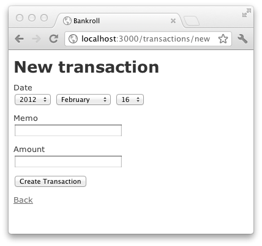

# Digging Around

Now is the time to jump into the app and start messing with things. What we are going to do for the next few chapters is create some basic functionality in our *bankroll* app and then study how this simple Rails application works and where things go.

It may feel like were going to be stuck here for awhile, but as with any complex app it is essential to build our foundational knowledge before moving forward with more code.

## Understanding Scope

Programmers will often refer to all of the things that need to be done for an application to be considered finished as "scope". The scope of an application is the starting place for all projects. It is from this point you will consider what the application does, how it will work, and what things are critical to implement and what things are not.

I've listed the basic scope of our application in the previous chapter so I won't review it here but we will, however, take the simplest part of the application and start there for our initial development.

The most basic essential to the *bankroll* app is tracking finances. If you really dilute it down to the most critical item it would most likely be the transactions feature. The most essential part of this application is to simply record that something was credited or debited.

So, now we look at this most simplified part of our application and we need to determine what a transaction is so we can go about our merry way implmenting it.

A transaction probably has the following attributes:

* **Date** - The date the transaction occurred.
* **Memo** - What this transaction was for.
* **Amount** - An amount that is either positive or negative to be added/removed from the total

That is probably about as simple as we can get without losing the idea of what a transaction is. Notice here that we are not concerning ourselves with users, accounts, categories, or anything else that for this project would make it actually useful. We are starting from a basic core and working our way up to complexity.

## Using The Rails Generators

Rails comes with commands to help you quickly create objects in Rails. We'll be using the scaffolding generator which will allow us to create and entire feature with one simple command.

To use create scaffolding for our transaction feature simply type:

```
	./bin/rails generate scaffold Transaction date:date memo:string amount:decimal
```

This will create a bunch of files for us and will look similar to this:

```
	invoke  active_record
	create    db/migrate/20120216223753_create_transactions.rb
	create    app/models/transaction.rb
	invoke    test_unit
	create      test/unit/transaction_test.rb
	create      test/fixtures/transactions.yml
	route  resources :transactions
	invoke  scaffold_controller
	create    app/controllers/transactions_controller.rb
	invoke    erb
	create      app/views/transactions
	create      app/views/transactions/index.html.erb
	create      app/views/transactions/edit.html.erb
	create      app/views/transactions/show.html.erb
	create      app/views/transactions/new.html.erb
	create      app/views/transactions/_form.html.erb
	invoke    test_unit
	create      test/functional/transactions_controller_test.rb
	invoke    helper
	create      app/helpers/transactions_helper.rb
	invoke      test_unit
	create        test/unit/helpers/transactions_helper_test.rb
	invoke  assets
	invoke    coffee
	create      app/assets/javascripts/transactions.js.coffee
	invoke    scss
	create      app/assets/stylesheets/transactions.css.scss
	invoke  scss
	create    app/assets/stylesheets/scaffolds.css.scss
```

Now that we have the basic scaffolding installed for managing transactions we can setup the development database like so:

```
	./bin/rake db:migrate
```

You should see the following output:

```
	==  CreateTransactions: migrating =============================================
	-- create_table(:transactions)
	   -> 0.0011s
	==  CreateTransactions: migrated (0.0012s) ====================================
```

Now, if we start our the rails development server:

```
	./bin/rails server
```

You should now be able to go to the <http://localhost:3000/transactions> page and start creating your very own transactions. There are currently no transactions so the page is a little sparse. Clicking on the 'New Transaction' link will take you to the following page in Fig 7-1 where you can fill in the information and create a new transaction.




## The Black Magic Of Scaffolding

How did we go from a blank application to something that allows us to create, edit, update, and delete a feature? Rails is considered "opinionated software" and as such makes certain assumptions about where things should go and how they should work by default. This makes is easy for Rails to leverage the creation of entire swaths of code without much hassle.

Will we be creating the entire app this way? Absolutely not. I would only recommend creating things this way if your throwing together something quick and dirty that you don't plan on keeping around ^[Which, almost always ends up sticking around and becoming important down the road so just do it right the first time.]

The reason we are using it now is that it allows us to get something running so we can then walk through the Rails project and see how things work.

I will clarify here though that the scaffolding is simply one generator Rails provides out of several. Many of the generators are very simple and their use is nice simply because they are quick and do something very menial. The problem with using scaffolding all the time is that it does too much for you that you should be invovled with when creating.


